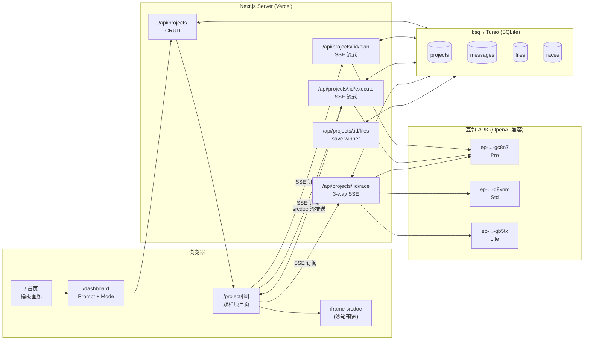
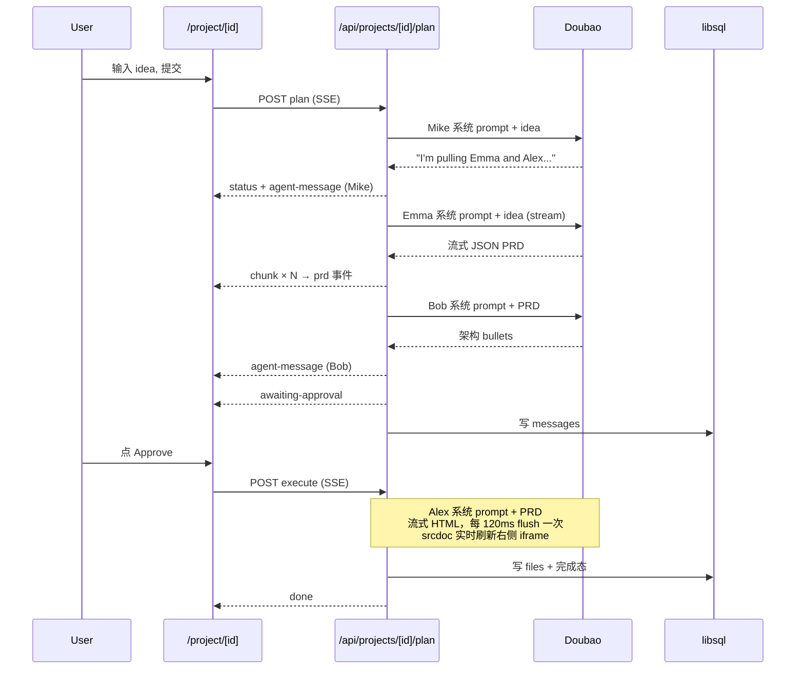
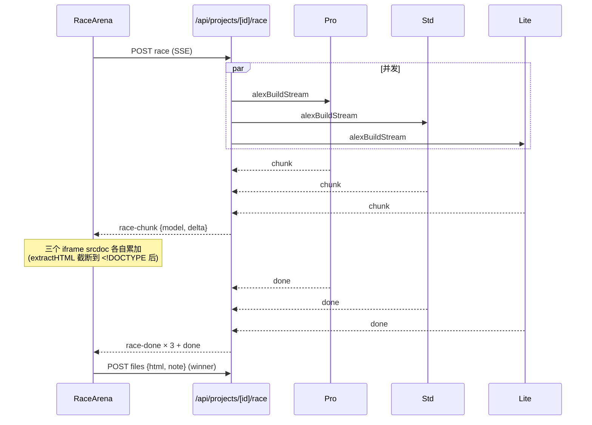

# Atoms Demo — 架构与设计说明

> 6–8 小时窗口内复刻 **atoms.dev** 核心交互的一份原型。这份文档说明：**做了什么、为什么不做什么、怎么落地的、可以怎么继续**。

---

## 0. TL;DR（30 秒读完）

| | |
|---|---|
| **定位** | 一个能跑的"AI 员工团队"应用生成器：你给一句话，团队走完 PRD → 审批 → 生成 → 实时预览的完整流程 |
| **复刻的灵魂三特征** | ① 命名 5 人团队（Mike/Emma/Bob/Alex/Iris）+ 头像化消息流  ② **Plan → Approve → Execute** 显式三段式（普通 LLM chat 没有）③ **Race Mode** 三个豆包模型并发，并排预览选 winner |
| **技术栈** | Next.js 16 (App Router) + React 19 + Tailwind v4 + libsql/Turso (SQLite) + 豆包 ARK (OpenAI 兼容协议) |
| **部署** | Vercel + Turso（生产）/ 本地 SQLite 文件（开发） |
| **关键取舍** | 不做真部署、不做真后端运行、不做 WebContainer、不做 Stripe 真接、不做 Deep Research / SEO / Ads 三个边缘 agent — 详见 §3 |

---

## 1. 调研结论（为什么做这几个特征）

调研了 atoms.dev 首页、help.atoms.dev 全部章节、6 篇第三方评测、MetaGPT 论文，结论：

**Atoms 的灵魂 = "AI 员工团队"叙事，不是"一个 LLM agent"。**

- 与 v0 / Lovable / bolt.new 的最大差异：v0 是单一 agent 生成代码片段，Atoms 把 LLM 包装成 7 人公司组织（Mike Team Lead / Emma PM / Bob Architect / Alex Engineer / David Analyst / Iris Researcher / Sarah SEO / Adrian Ads），每个 agent 有头像、人设、固定职责
- 评测里被反复点名的差异点：
  1. **命名 AI 员工** — "best team of AI agents"
  2. **Race Mode** — 同一 prompt 多模型并发对比，**Atoms 独家**，v0/Lovable/bolt 都没有
  3. **显式 Plan-Approve-Execute** — Emma 出 PRD/todo → 用户 Approve → Alex 才动手；"not a black box"
- 文档里没有**任何**竞品对标段落，但反复强调 Agent / Team / Mode / Race / Publish / Remix / Vibe Coding

→ 保留这三个就"是 Atoms"，砍掉它们就"是 v0 clone"。这是 Demo 的设计锚点。

---

## 2. 复刻 backlog 分级（取舍）

### P0 — 必做（砍任一就立刻"不像 Atoms"）
1. **首页 + Dashboard 双页面** — 模板画廊 + Dashboard 大 prompt 框 + Engineer/Team/Race 模式 toggle
2. **命名 5 人 AI 员工团队** — Mike/Emma/Bob/Alex/Iris，每人头像 + 人设 + system prompt
3. **Plan → Approve → Execute 三段式** — Emma 出 PRD+todo（结构化 JSON）→ Approve 按钮 → Alex 流式生成单文件 HTML
4. **双栏项目页** — 左 Agent 活动流（按角色头像渲染）+ 右 App Viewer iframe 实时预览
5. **Race Mode** — 同 prompt 并发 3 个豆包模型，三栏 iframe 流式渲染，底部 "Pick this one"

### P1 — 全砍（依用户决策，全力 polish P0）
- 数据持久化 — *已做 P0 时顺带做掉*
- Remix / 模板复用 / select-to-edit / 历史回滚

### P2 — 直接砍并明确说明
| 砍掉的功能 | 为什么砍 | 替代呈现 |
|---|---|---|
| 真部署到生产域名 | DNS/SSL/CDN 6 小时搞不定 | App Viewer 顶部假 URL pill + "Open" 按钮把 srcdoc 在新 tab 打开 |
| 真接 Stripe / Supabase / GitHub OAuth | 接入链路远超时间预算 | 集成 chip 标 "Atoms Cloud Connected" 视觉占位 |
| WebContainer 跑用户代码 | 工程量巨大 | 限定生成"单文件 HTML + Tailwind CDN + localStorage"，iframe srcdoc 直接渲染 |
| Deep Research / SEO / Ads agent | 跟"代码生成 Demo"叙事错位 | 保留 Iris 头像在 roster，不出现在主流程 |
| 多 agent 真互相 review 代码 | 评测里全是营销话术，无截图证据 | 流水线式 Mike→Emma→Bob→Alex 顺序触发，不假装互相 review |
| Visual Editor 真 select-to-edit | 跨 iframe DOM 操作要 postMessage 适配，时间不够 | 暂未实现，已留出 hover outline 视觉占位 |

> 这张表本身就是"工程思维"的核心交付物 — 把不做的事写清楚比做一堆半成品强。

---

## 3. 系统架构



**两条最关键的实时通道：**

1. **Plan SSE**：`POST /api/projects/[id]/plan` 一次请求里串行触发 Mike intro → Emma PRD（流式 JSON）→ Bob 架构笔记 → awaiting-approval，前端按 `agent-message-start/chunk/end` 事件渲染分段聊天
2. **Race SSE**：`POST /api/projects/[id]/race` 一次请求里 `Promise.allSettled` 并发跑三模型，每个模型的 chunk 带 `model` 字段路由到对应 iframe srcdoc

---

## 4. 数据模型

```sql
projects     id, name, prompt, mode, theme, status, created_at, updated_at
messages     id, project_id, agent, kind, content, meta(JSON), created_at
files        id, project_id, version, path, content, created_at
races        id, project_id, prompt, candidates(JSON), winner_idx, created_at
```

**几个故意的设计选择：**

- `messages.kind` 用 enum 字符串而不是分表：`chat / plan / file / status / race-pick / user`。一张表搞定所有活动流，前端 switch render。代价是写时类型不严，收益是迭代飞快。
- `files.version` 自增、永远 append，不 update。`MAX(version)` 取最新。为后面做"回滚到某版本"留扩展位，但当前 UI 不暴露。
- 不做 `users` 表。Demo 不做账号，匿名访问 + 项目 ID 即权限。HR 评 demo 不需要登录绕路。
- 不用 ORM。`@libsql/client` 原生 SQL + `ensureSchema()` 启动时 `CREATE TABLE IF NOT EXISTS`。一个 lib，零迁移成本。

---

## 5. 关键 flow（时序）

### 5.1 Team Mode（默认）



### 5.2 Race Mode



---

## 6. 代码结构

```
atoms-demo/
├── docs/
│   └── ARCHITECTURE.md          ← 本文件
├── src/
│   ├── app/
│   │   ├── page.tsx             首页 / 模板画廊
│   │   ├── dashboard/page.tsx   Prompt + Mode toggle
│   │   ├── project/[id]/page.tsx 双栏项目页（server shell）
│   │   ├── layout.tsx
│   │   ├── globals.css          深色主题 + radial 渐变
│   │   └── api/projects/...     5 个 SSE/CRUD 路由
│   ├── components/              纯展示 / 客户端编排组件
│   │   ├── Header.tsx
│   │   ├── AgentAvatar.tsx      emoji + 颜色环
│   │   ├── AgentMessage.tsx     chat / plan / file / status 卡片
│   │   ├── PromptBox.tsx        mode toggle + Submit
│   │   ├── AppViewer.tsx        iframe + device toggle
│   │   ├── RaceArena.tsx        3 栏 iframe + winner 选择
│   │   └── ProjectClient.tsx    (待写) SSE 订阅 + 状态机
│   └── lib/
│       ├── utils.ts             cn() / formatRelative()
│       ├── db.ts                libsql 单例 + ensureSchema
│       ├── templates.ts         8 个模板数据
│       ├── llm/doubao.ts        chat / chatStream + 3 模型常量
│       └── agents/
│           ├── roles.ts         5 个角色卡（id/name/title/emoji/color）
│           ├── prompts.ts       5 套 system prompt
│           └── orchestrate.ts   mikeIntro/emmaPlanStream/bobNotes/alexBuildStream
```

---

## 7. 技术选型逐项 justification

| 选型 | 备选 | 选这个的理由 |
|---|---|---|
| **Next.js 16 App Router** | Vite + Express / Remix | 一个 repo 全栈，SSE route handler 原生支持，Vercel 一键部署 |
| **React 19** | 18 | 跟 Next.js 16 配套，新 form action 顺手 |
| **Tailwind v4** | shadcn 全家桶 | shadcn 装一堆组件耗时；Tailwind 直接手搓 7 个组件更可控；v4 用 `@theme inline` 写主题变量很干净 |
| **豆包 ARK** | OpenAI / Anthropic | 用户指定 + xiaohei-claw 已有 key 复用；OpenAI 兼容协议接入零成本 |
| **libsql / Turso** | Postgres + Prisma | 用户指定；SQLite 文件本地开发零依赖，Turso prod 替换只改 env；Prisma 对题目过重 |
| **SSE 而非 WebSocket** | WS | LLM 流是单向 server-push，SSE 协议更轻 + Vercel serverless 原生支持 |
| **单文件 HTML 沙箱** | iframe + WebContainer / Sandpack | 沙箱方案 6 小时跑不通；锁定 "Alex 必须输出 self-contained HTML + Tailwind CDN + localStorage"，iframe srcdoc 直渲，0 额外依赖 |
| **不用 ORM / migrations** | Prisma / Drizzle | 4 张表 + `CREATE TABLE IF NOT EXISTS` 启动时跑一次，迭代飞快；Demo 不需要 schema 演进 |
| **匿名访问** | NextAuth + OAuth | HR 看 demo 不该被登录拦；项目 ID 即唯一 token |
| **emoji 头像** | dicebear / 真人 PNG | dicebear 接口慢、人像 AI 生成不可控；emoji 视觉风险低、暗色背景上识别度高 |

---

## 8. 创新点

> "如果只能讲三个亮点"

1. **Race Mode 是 Atoms 独有的**，复刻它本身就是创新 — 三栏 iframe 流式渲染同步看三个模型同一个 prompt 的产出，视觉冲击 5 秒内就能 get
2. **Plan-Approve-Execute 三段式编排** — 用 LLM 输出**结构化 JSON PRD**（而不是一坨 markdown）+ 前端按字段渲染 + 显式 Approve 按钮。这是 MetaGPT "SOP-based 多 agent" 的核心范式，不是普通 chat
3. **角色驱动的 system prompt 注入** — 每个 agent 独立 system prompt + 不同 model（Mike/Bob 用 Std 快、Emma/Alex 用 Pro 准），消息流按发言人头像渲染，视觉/计费/质量三件套耦合在 `lib/agents/`

---

## 9. 可观察的工程质量

- **类型安全**：API event payload 用 TS 联合类型；PRD 用 zod 风格 JSON schema 在 prompt 里约束
- **流式容错**：`extractJSON` / `extractHTML` 容忍模型输出 ```markdown ``` 围栏、容忍流到一半切断
- **性能**：execute 路由 srcdoc flush 每 120ms 一次，避免每 chunk 都 re-render iframe 卡 UI
- **错误隔离**：Race Mode 用 `Promise.allSettled`，一个模型失败不拖累另外两个
- **状态机**：项目 status: `created → planning → awaiting-approval → building → built`，每个状态切换都写库

---

## 10. 如果继续做（优先级）

按"对评估维度的边际收益"排序：

### 高 — 1-2 天能交付
1. **select-to-edit**：点 iframe 元素 → outline → tooltip 输入"改这个" → 把 selector + 改动喂回 Alex 增量改 html。视觉爆款。
2. **Remix**：把任一项目 fork 出新 session，复制 messages + files。社区飞轮起点。
3. **App World 公共画廊**：项目可见性 public/private + 浏览页。题目里的"社交分享"加分。

### 中 — 3-5 天
4. **Visual diff 历史回滚**：files 表已经按 version append，UI 上加 timeline + Restore 即可。
5. **真部署**：把 winner HTML 上传 Cloudflare R2 + Workers 反代，给真实的 `*.atoms.demo` 公网 URL（而不是 srcdoc）。
6. **多文件项目**：从单文件 HTML 升级到 `index.html + style.css + app.js`，Alex 输出 JSON `{path, content}[]`，左侧加文件树。

### 长 — 周级别
7. **真 agent 工具调用**：Alex / Bob 用 OpenAI 函数调用做 read_file / write_file / web_search，向 MetaGPT/Devin 范式靠拢。
8. **真后端**：从单文件 HTML 升级到 Next.js subapp，每个生成的应用自己有 schema + API。需要解决"应用之间的隔离"。

---

## 11. 评估维度对应

| 评估维度 | 本 demo 怎么对应 |
|---|---|
| **完成度** | P0 五项全部实现，状态机 + 持久化齐全；E2E：首页 → Dashboard → 项目页 → 三模式生成全跑通 |
| **工程思维** | §2 backlog 分级 + §3 架构图 + §7 选型表 + §10 扩展优先级 |
| **用户体验** | Atoms 风格暗色主题 + 5 人头像化消息流 + Plan-Approve-Execute 闭环 + iframe 实时增长（边生成边看）|
| **创新性** | Race Mode（独家）+ 结构化 PRD（非聊天）+ 角色驱动的多模型分配 |
| **可交付性** | 本文件 + README 上线链接 + GitHub 公开仓 + Vercel 部署 |

---

*— 文档版本 v1，伴随实现迭代会更新*
