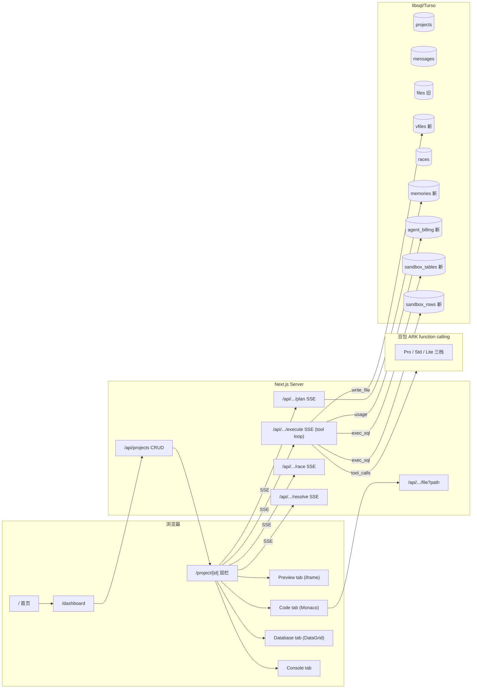

# Atoms Demo 交付方案 v2

> 按用户三阶段拆分。范围档 = **B（一阶段 MVP + 简化二阶段）**，估时 ~10-12h。
> 配套：[ARCHITECTURE.md](./ARCHITECTURE.md) · [MODULES.md](./MODULES.md) · [PROGRESS.md](./PROGRESS.md)

---

## §0 摘要

| | |
|---|---|
| **范围档** | **B** — 一阶段 MVP + 简化二阶段。把 demo 从"假装 agent"拔到"真 agent 平台架构骨架" |
| **新加的硬骨头** | ① 工具执行（OpenAI 兼容 function calling loop）② 文件沙箱（vfiles 表 + write_file tool）③ DB 沙箱（sandbox_tables + exec_sql tool）④ 短期记忆（prompt 注入版）⑤ agent 计费 ⑥ 多通道预览（HTML/Code/DB/Console）|
| **保留 v1 核心** | 5 人命名团队 / Plan-Approve-Execute / Race Mode / Stop / 双层沙箱（prompt 约束 × iframe sandbox）|
| **明确砍掉** | 对话版本 / SSH 真接 / 短期记忆 tool / 真部署 / 真 Supabase / Visual Editor 改 DOM / supervisor LLM router / group chat |
| **技术栈** | Next.js 16 + React 19 + Tailwind v4 + libsql/Turso + 豆包 ARK function calling + Monaco lazy-load + xterm.js（fake 终端用）|
| **部署** | Vercel + Turso |

---

## §1 调研结论（六维度 + agent 间通信，沿用 v1）

详见 v1 的 §1，结论不变：

- **数据库** — Atoms Cloud = Supabase Postgres + RLS（推测）；demo 用 libsql 多租户 partition by project_id
- **文件/代码预览** — Atoms 把代码藏在 advanced；demo 用 Monaco 只读 lazy-load + 假 Next.js 风格文件树
- **浏览器预览+中断** — Atoms 有 per-agent Stop + Console + per-error Resolve；demo 实现 AbortController + 模拟 Console
- **多 agent 调度** — Atoms = MetaGPT SOP + Supervisor + @-mention 三层；demo 用硬编码流水线 + @-mention（不做 supervisor LLM）
- **编辑器** — Atoms 有 advanced 编辑器但隐藏；demo 用 Monaco 只读
- **agent 间通信** — Atoms = 结构化文档单向接力；demo 完全对齐（详见 §4）

---

## §2 三阶段功能分级（按你的拆分）

### Phase 1 · 后端底盘 / Agent 能力（MVP 版）

| # | 能力 | MVP 实现 | 估时 |
|---|---|---|---|
| 1.1 | **多 agent 分发** | 硬编码 Mike→Emma→Bob→Alex 流水线 + textarea `@Agent` 解析 + Engineer/Team Mode toggle | 0.5h（基本已有）|
| 1.2 | **多 agent 上下文交互** | §4 三层共享：Workspace 持久化（messages 表）+ Plan 文件接力（Emma JSON PRD）+ Per-agent 短上下文 | 1h（已设计）|
| 1.3 | **短期记忆**（prompt 注入版）| `memories(project_id, key, value, source_agent)` 表；Emma PRD 里专门有 `preferences` 字段写入 memories；下游 Bob/Alex system_prompt 顶部注入 `## Active memories:` 段 | 1h |
| 1.4 | **工具执行**（OpenAI function calling 兼容）| 2 个工具 MVP：`write_file(path, content)` + `exec_sql(sql)`；豆包 `tools` 参数 + tool_calls 循环；前端流式渲染 tool call 卡片 | 2.5h |
| 1.5 | **文件沙箱** | `vfiles(project_id, path, content, version)` 表；Alex 多次调 `write_file` 而不是一次 dump HTML；index.html 作为 iframe 入口 | 1.5h |
| 1.6 | **数据库沙箱** | `sandbox_tables(project_id, name, schema_json) + sandbox_rows(project_id, table, row_json)` 双表实现"虚拟 SQL"；Bob 调 `exec_sql("CREATE TABLE trips(...)")` 真创建；DataGrid 浏览 | 2h |
| | **Phase 1 小计** | | **~8.5h** |

### Phase 2 · 前端 + 用户交互（简化版）

| # | 能力 | 简化实现 | 估时 |
|---|---|---|---|
| 2.1 | **基础会话界面** | 沿用 v1：Header / AgentAvatar / AgentMessage / 双栏布局；新写 `/`, `/dashboard`, `/project/[id]` 三页 + `ProjectClient.tsx` SSE 编排 | 1.5h（部分已有）|
| 2.2 | **会话 ↔ 预览联动** | App Viewer 顶部 4 tab：`Preview / Code / Database / Console`；file 卡片点击 → 切 Code tab + 滚到对应文件；DB 操作卡片 → 切 Database tab；Console 错误 → 切 Console tab | 1h |
| 2.3 | **编辑器** | `@monaco-editor/react` lazy-load 在 Code tab；只读模式；语法高亮按文件扩展名 | 0.5h |
| 2.4 | **文件** | 左侧 mini 文件树 from `vfiles` 表；点文件 → 右侧 Monaco 显示内容；图片/markdown 用不同 viewer | 1h |
| 2.5 | **agent 计费** | `agent_billing(id, project_id, agent, model, input_tokens, output_tokens, cost_cents, created_at)` 表；每次 LLM 调用记账；侧栏小 widget "Used $0.043 · 12,300 tokens" 累加显示；单价表硬编码（pro/std/lite 三档） | 1.5h |
| | **Phase 2 小计** | | **~5.5h** |

### Phase 3 · 不做（明确）

- 对话版本（fork/diff/rollback）
- 真 SSH / 真终端（用 fake 终端 + xterm.js 视觉，不接真 shell）
- 短期记忆 tool 化版（用 prompt 注入足够）
- 真部署到生产域名
- 真 Supabase / GitHub OAuth
- Visual Editor 点元素改 DOM
- Supervisor LLM router 动态调度
- agent 互相 @ / group chat
- WebContainer / 真多文件 Next.js 生成
- Iris Deep Research / Sarah SEO / Adrian Ads

---

## §3 多通道预览渲染方案

App Viewer 顶部 **4 tab**，每个 tab 一种渲染通道：

```
[ Preview ]  [ Code ]  [ Database ]  [ Console ]
```

### 3.1 Preview — HTML/iframe srcdoc

**组件**：`<HtmlPreview vfiles={Map} entry="index.html" deviceMode />`

**渲染策略**（两方案权衡）：

| 方案 | 怎么做 | 优点 | 缺点 | 选哪个 |
|---|---|---|---|---|
| **A. srcdoc + inline 全部** | Alex 把 CSS/JS inline 进 `index.html`；iframe `srcDoc={index.html.content}` | 实现最简单，srcdoc 一次性渲染；同源不需要单独路由 | 多文件叙事破坏（HR 看 Code tab 只有 index.html 一个文件不真）| **MVP 默认 A** |
| **B. iframe src + 同源服务** | iframe `src="/api/projects/:id/preview"` 返回最新 index.html；相对路径 fetch 走 `/api/projects/:id/file?path=...` | 真多文件，文件树真实；Alex 可以独立写 `style.css` / `app.js` | iframe `src` 跨页面导航需要服务端路由 + CSP 协调；srcdoc 流式更新更难 | **时间够升 B** |

**流式刷新策略**：
- 每个 `write_file` tool 完成后 emit `preview-update` 事件 → 前端 setState srcDoc
- 节流 120ms（每 chunk 刷会让 React 反复 unmount iframe 卡死）
- iframe key 用 `Math.floor(version / 4)` 之类的方式控制 - 不是每次都换 key 卸载，只在大版本切换时换

**iframe 属性**（5 个 sandbox flag）：
```typescript
sandbox="allow-scripts allow-forms allow-popups allow-modals allow-same-origin"
```

**工具栏**：Mac 三色圆点 / 假 URL pill `atoms-cloud://preview/index.html` / 设备 toggle（desktop=100% / tablet=820px / phone=390px）/ Refresh / Open in new tab（Blob URL 兜底 Publish）

**对 postMessage**（与 Console 通道协作）：iframe 内 JS error 通过 `window.onerror` → `parent.postMessage({type: 'console-error', ...})`

### 3.2 Code — Monaco 只读 + 文件树

**组件结构**：
```
<CodePanel>
  ├─ <FileTree files={vfiles} activePath={...} onSelect={...} />  // 左 16%
  └─ <CodeView>                                                    // 右 84%
       ├─ <Breadcrumb path="src/app.js" />
       └─ <Monaco language=... value=... options={readOnly: true}/>
</CodePanel>
```

**Monaco 集成**：
```typescript
const Monaco = dynamic(() => import('@monaco-editor/react'), { ssr: false });

<Monaco
  height="100%"
  language={inferLang(activeFile.path)}      // html / javascript / typescript / css / markdown / json
  value={activeFile.content}
  theme="vs-dark"
  options={{
    readOnly: true,
    minimap: { enabled: false },
    fontSize: 13,
    scrollBeyondLastLine: false,
    lineNumbers: 'on',
    renderLineHighlight: 'gutter',
    smoothScrolling: true,
  }}
  onMount={(editor) => editorRef.current = editor}
/>
```

**lazy-load**：`@monaco-editor/react` ~600KB gz；用 `dynamic(..., { ssr: false })` 切到 Code tab 才载入，不影响首屏

**流式更新时光标保留**：Monaco 自带 diff-apply，`value` prop 变化时只重渲变化的行，光标位置 / 滚动位置保留。无需手动 setModel。

**高亮 ranges（给 `focus_file(path, line)` 用）**：
```typescript
editor.deltaDecorations(prevDecorations, [
  {
    range: new monaco.Range(line, 1, line, 1),
    options: { isWholeLine: true, className: 'highlight-flash' },
  }
]);
editor.revealLineInCenter(line);
```

**FileTree 实现**：
- 输入：`vfiles` 数组（每行 `{path, content, version}`）
- 解析 path 用 `/` 分割成树状结构
- 文件夹折叠，文件可点击 → emit `onSelect(path)`
- 文件 icon 按扩展名（html 橙 / js 黄 / css 蓝 / md 灰）
- 当前激活文件高亮

**不可编辑** — Atoms 哲学是"agent 拥有代码，人通过 chat 驱动"。HR 戳一下发现是只读，话术站得住

### 3.3 Database — DataGrid + Schema View

**组件结构**：
```
<DatabasePanel>
  ├─ <SchemaTree tables={sandboxTables} activeTable={...} onSelect={...} />  // 左 20%
  └─ <TableView>                                                              // 右 80%
       ├─ <TableHeader name="trips" rowCount=42 />
       ├─ <DataGrid columns={schema} rows={rows} />
       └─ <SqlConsole onExec={(sql) => ...} />  (可选)
</DatabasePanel>
```

**SchemaTree**（左）— 列 sandbox_tables：
```
📁 trips                        42 rows
   ├ 🔑 id        INTEGER  PK
   ├ user_id     TEXT
   ├ destination TEXT
   ├ start_date  TEXT
   └ created_at  INTEGER

📁 users                         5 rows
   ├ 🔑 id        TEXT     PK
   └ ...
```

**DataGrid**（右）— **不用三方库**，自写 60 行：
```typescript
<table className="w-full text-sm">
  <thead className="bg-bg-elev sticky top-0">
    <tr>{columns.map(c => <th key={c.name}>{c.name} <span>{c.type}</span></th>)}</tr>
  </thead>
  <tbody>
    {rows.map(row => (
      <tr className="border-b border-border hover:bg-bg-elev">
        {columns.map(c => <td className="font-mono">{formatCell(row[c.name])}</td>)}
      </tr>
    ))}
  </tbody>
</table>
```
- 简单粗暴够用（<500 行不需要虚拟滚动）
- `formatCell` 处理 null / 长字符串截断 / JSON / date
- 行 hover 高亮，行点击展开详情（可选）

**SqlConsole**（底部可选）— 给评委自己 query：
```html
<input placeholder="SELECT * FROM trips WHERE user_id = 'u1' LIMIT 10" />
<button>Run</button>
```
- 调 `exec_sql` API（与 agent 共用）
- 结果直接渲到上方 DataGrid
- **如果时间紧，砍掉**

**show_table tool 联动**：agent 调 `show_table("trips")` → 切 Database tab + SchemaTree 高亮 trips + DataGrid 显示 trips 数据

### 3.4 Console — 错误流 + Resolve

```
[ERROR] Uncaught TypeError: cannot read property 'map' of undefined
       at app.js:42:5
       [Resolve →]
```

- iframe 内 JS error 通过 `window.onerror` → `parent.postMessage`
- 父页面捕获后渲染到 Console tab
- 每条 error 一个 **Resolve** 按钮 → 把 stack trace 喂给 Alex 重新调 `write_file`
- 也显示 agent 的"工具调用"日志（`Alex called write_file('index.html', 4.2kB)`）

### 3.5 流式日志（嵌在活动流，不是独立 tab）

agent 的"思考"/工具调用 partial / Stop 后的半成品，用：
- `<pre>` + autoscroll
- 浅色字体不抢戏
- 折叠按钮 "Show 23 more lines"

### 3.6 预览编排策略 — 被动联动 vs Agent 主动展示 tool（**用户洞察**）

**核心问题**：agent 调完 `write_file` 后，右侧 4 tab 怎么切？

**两种范式 + 我们用 hybrid**：

| 范式 | 怎么做 | 优点 | 缺点 |
|---|---|---|---|
| **A. 被动联动**（v1 默认） | 前端硬编码：写 file → 自动切 Code tab；exec_sql → 自动切 Database tab | 简单，agent 不用关心 UI | 联动逻辑死在前端，agent 没法"导览" |
| **B. Agent 主动展示 tool**（你的洞察） | 加一组 `focus_file / show_table / show_preview / show_console` tool；agent 写完 file 后**显式**调 `show_preview()` | agent 主导用户视线，能讲故事："写完 index.html → 切 Preview tab → '看看效果'" | tool 数量增加，agent 要学会"动手时记得展示" |

**Demo 用 hybrid**：
1. **默认联动保 baseline**：写 file → 默认切 Code tab + 高亮该文件；exec_sql CREATE → 默认切 Database tab + 高亮该 table。即使 agent 忘了调展示 tool，UI 也对得上
2. **显式展示 tool 让 agent 主导**：agent 想"导览"时显式调，override 默认联动
3. **典型 demo 脚本**：
   - Bob 调 `exec_sql("CREATE TABLE trips...")` → 自动切 Database tab → 用户看到 schema 出现
   - Bob 调 `show_table("trips")` → 显式聚焦该 table（如果有多个表，agent 决定主推哪个）
   - Alex 调 `write_file("index.html", ...)` → 自动切 Code tab 显示 index.html
   - Alex 写完 3 个文件后调 `show_preview()` → 切回 Preview tab → "现在看看效果"
   - 用户在 Preview 操作发现 bug → Console error → 点 Resolve → Alex 调 `focus_file("app.js", line=42)` → 切 Code tab + 高亮第 42 行 → "找到了"

这套联动设计是 demo 的**叙事核心** —— HR 看 5 秒就能 get "agent 在主导，不是用户在翻"。

详细 tool 设计见 [§5.5 Presentation Tools](#55-presentation-tools用户洞察)。

---

## §4 Agent 间上下文 / Memory / Plan 共享（强化 §4.2 短期记忆）

### 4.1 三层共享模型（同 v1）

```
Layer 3 · Workspace 持久化         projects/messages/files/vfiles 表
                                    → UI 回放 + Stop/Resume，agent 不主动读
Layer 2 · Plan 文件中间产物         Emma JSON PRD → Bob/Alex 单向接力
Layer 1 · Per-Agent 瞬时上下文       system_prompt + user_msg（含上一步产物）
                                    → 不传 chat 历史
```

### 4.2 短期记忆 MVP（prompt 注入版）— **本次新加**

**思路**：Emma 在产出 PRD 时被强制带一个 `preferences: { key: string, value: string }[]` 数组字段，专门记录"用户偏好的颜色/布局/技术风格"等。这些 entries 写入 `memories` 表，下游 Bob/Alex/任何 Resolve 都把它们注入 system_prompt 顶部：

```
## Active memories (from earlier in this project)
- theme_color: indigo (Emma extracted from initial idea)
- preferred_data_persistence: localStorage (Emma)
- accessibility: high contrast required (User, follow-up)
```

**Schema**:
```sql
memories(
  id TEXT PRIMARY KEY,
  project_id TEXT,
  key TEXT,
  value TEXT,
  source_agent TEXT,
  created_at INTEGER
)
```

**关键设计**：
- ✅ 只在**项目内**共享，不跨项目（不做 vector store / cross-project RAG）
- ✅ 注入 system_prompt 顶部，而不是塞 chat 历史 → 上下文短 + agent 主动遵守
- ✅ Tool 版（`save_memory(key, value)` 让 agent 主动写）放 Phase 3 不做 — MVP 用 Emma 一次性提取够用
- ❌ 不做语义检索（项目内 entries 通常 <20 条，全注入就行）
- ❌ 不做 expiry / decay

### 4.3 Stop / Resume 时怎么"记得"

LLM 本身无状态，Resume = 把 `messages.meta.partial`（被 Stop 时保留的半成品）+ 用户修正打包成新 user_msg 重发，不是恢复 LLM 内部状态。

### 4.4 vs Atoms 真品

| 维度 | Atoms 真品 | Demo |
|---|---|---|
| 中间产物 | JSON PRD + 架构文档 + 代码 | ✅ JSON PRD + bullets + 多文件（vfiles）|
| 接力方向 | 单向 | ✅ |
| Cross-agent chat | ❌ | ✅ 不做 |
| 短期记忆 | 未公开 | ✅ memories 表 + prompt 注入版 |
| Long-term memory | 未公开 | ❌ 不做 |
| Stop 保留 partial | ✅ | ✅ messages.meta.partial |

---

## §5 工具执行（Tool Use）设计

### 5.1 协议 — OpenAI function calling 兼容

豆包 ARK 是 OpenAI 兼容协议，原生支持 `tools` 数组 + `tool_calls` 返回 + `tool` role message。我们直接用 OpenAI 工具格式：

```typescript
// 请求
{
  model: "ep-...",
  messages: [...],
  tools: [
    {
      type: "function",
      function: {
        name: "write_file",
        description: "Write a file to the project sandbox...",
        parameters: { type: "object", properties: {...}, required: [...] }
      }
    },
    // exec_sql
  ],
  tool_choice: "auto",
  stream: true,
}

// 流式响应 (tool_calls 在 stream 里以 delta 形式累积)
data: {"choices":[{"delta":{"tool_calls":[{"index":0,"id":"call_xx","function":{"name":"write_file","arguments":"{\"path\":\""}}]}}]}
data: {"choices":[{"delta":{"tool_calls":[{"index":0,"function":{"arguments":"index.html\",\"content\":\"..."}}]}}]}
...
```

### 5.2 2 个 MVP 工具

**Tool A：`write_file`**
```typescript
{
  name: "write_file",
  description: "Write a file to the project's virtual file sandbox. Overwrites if exists. Used by Alex to build the app file by file.",
  parameters: {
    type: "object",
    properties: {
      path: { type: "string", description: "Relative path like 'index.html', 'app.js', 'style.css'" },
      content: { type: "string", description: "Full file content" }
    },
    required: ["path", "content"]
  }
}

// 后端 handler
async function handle_write_file(projectId, { path, content }) {
  await db.execute({
    sql: "INSERT INTO vfiles (id, project_id, path, content, version, created_at) VALUES (?, ?, ?, ?, ?, ?)",
    args: [nanoid(), projectId, path, content, await nextVersion(projectId, path), Date.now()]
  });
  return { success: true, path, size: content.length };
}
```

**Tool B：`exec_sql`**
```typescript
{
  name: "exec_sql",
  description: "Execute a CREATE TABLE / INSERT / UPDATE / DELETE on the project's sandbox database. Used by Bob to set up data schema and seed sample rows.",
  parameters: {
    type: "object",
    properties: {
      sql: { type: "string", description: "A single SQL statement" }
    },
    required: ["sql"]
  }
}

// 后端 handler - 不真跑 sqlite，自己解析
async function handle_exec_sql(projectId, { sql }) {
  const parsed = parseSimpleSQL(sql);  // 只支持 CREATE TABLE / INSERT
  if (parsed.kind === "create_table") {
    await db.execute("INSERT INTO sandbox_tables ...", [projectId, parsed.name, JSON.stringify(parsed.columns)]);
    return { success: true, message: `Created table ${parsed.name}` };
  }
  if (parsed.kind === "insert") {
    for (const row of parsed.rows) {
      await db.execute("INSERT INTO sandbox_rows ...", [projectId, parsed.table, JSON.stringify(row)]);
    }
    return { success: true, message: `Inserted ${parsed.rows.length} rows into ${parsed.table}` };
  }
  return { success: false, error: "Unsupported SQL" };
}
```

### 5.3 工具调用循环（核心）

```typescript
async function* runAgentWithTools(agent, messages, tools, signal) {
  while (true) {
    if (signal.aborted) return;
    const stream = chatStream({ model, messages, tools, signal });
    let toolCalls = [];
    let textBuffer = "";
    for await (const delta of stream) {
      if (delta.content) { textBuffer += delta.content; yield { type: 'text', delta: delta.content }; }
      if (delta.tool_calls) { /* 累积 tool_calls 数组 */ }
    }
    if (toolCalls.length === 0) {
      messages.push({ role: 'assistant', content: textBuffer });
      return;
    }
    // 执行每个 tool call
    for (const tc of toolCalls) {
      yield { type: 'tool-call', call: tc };
      const result = await executeTool(projectId, tc.function.name, JSON.parse(tc.function.arguments));
      yield { type: 'tool-result', call_id: tc.id, result };
      messages.push({ role: 'assistant', tool_calls: [tc] });
      messages.push({ role: 'tool', tool_call_id: tc.id, content: JSON.stringify(result) });
    }
    // 继续循环：让 LLM 看到 tool 结果决定下一步
  }
}
```

**循环终止**：模型决定不再调 tool（只出 content） → 写最终 assistant message → return

**安全卡死**：max 8 轮工具调用，超出强制终止（避免 LLM 死循环写文件）

### 5.4 前端 tool call 卡片渲染

在活动流里，tool call 是一种新的 message kind：

```
⚡ Alex
   🛠 Wrote index.html · 3.2 KB ✅
   🛠 Wrote app.js · 1.1 KB ✅
   🛠 Wrote style.css · 0.4 KB ✅
   👁 Show preview                    ← presentation tool 也显示
```

每行可点击 → 切对应 tab + 跳到该文件/table/error。

### 5.5 Presentation Tools（用户洞察）

**4 个展示 tool**，跟副作用 tool 平级，agent 主动调来"导览用户视线"。

```typescript
// Tool 3: focus_file — 切 Code tab + 聚焦某文件，可选高亮某行
{
  name: "focus_file",
  description: "Switch the right panel to Code tab and focus on a file. Optionally highlight a specific line. Use this to draw the user's attention to code you just wrote or want to discuss.",
  parameters: {
    type: "object",
    properties: {
      path: { type: "string", description: "File path, e.g. 'index.html'" },
      line: { type: "integer", description: "Optional 1-indexed line number to highlight" }
    },
    required: ["path"]
  }
}

// Tool 4: show_table — 切 Database tab + 聚焦某 table
{
  name: "show_table",
  description: "Switch the right panel to Database tab and focus on a table. Use after creating a table or inserting rows you want the user to see.",
  parameters: {
    type: "object",
    properties: {
      table: { type: "string", description: "Table name" }
    },
    required: ["table"]
  }
}

// Tool 5: show_preview — 切 Preview tab 并强刷
{
  name: "show_preview",
  description: "Switch the right panel to Preview tab and force-refresh the iframe to show the latest app. Use when you've finished a batch of edits and want the user to try the app.",
  parameters: { type: "object", properties: {} }
}

// Tool 6: show_console — 切 Console tab（debug/查 error 场景用）
{
  name: "show_console",
  description: "Switch the right panel to Console tab to show errors or agent activity log. Use when investigating an error reported by the user.",
  parameters: { type: "object", properties: {} }
}
```

**实现方式**：
- 跟副作用 tool 同一个 loop 里处理
- handler 不写库，而是通过 SSE 推一个特殊事件 `data: {type: 'ui-focus', target: 'code', path: 'index.html', line: 42}`
- 前端 reducer 接收后 setState 切 tab + 高亮，所有内存层动作 0 数据库 IO
- 算 tool call 但不算 token cost（handler 无延迟）

**system prompt 教 agent 用**：在 Alex/Bob 的 system_prompt 里追加：
> "After a batch of file writes or DB ops, call `show_preview()` or `show_table()` to draw the user's attention. After finding an error, call `focus_file(path, line)` to point at the relevant code. Be a director — guide where the user looks."

**hybrid 联动**：详见 §3.6 — 即使 agent 忘了调，默认联动也会切对的 tab。展示 tool 是**锦上添花**不是必需。

**Tool 总览（6 个）**：

| # | Tool | 类型 | handler 副作用 | 计 token cost |
|---|---|---|---|---|
| 1 | `write_file` | 副作用 | 写 vfiles 表 | ✅ |
| 2 | `exec_sql` | 副作用 | 写 sandbox_tables/rows | ✅ |
| 3 | `focus_file` | 展示 | 仅 SSE 推 UI 事件 | ✅（但很少 token）|
| 4 | `show_table` | 展示 | 仅 SSE 推 UI 事件 | ✅ |
| 5 | `show_preview` | 展示 | 仅 SSE 推 UI 事件 | ✅ |
| 6 | `show_console` | 展示 | 仅 SSE 推 UI 事件 | ✅ |

**MVP 时间估算**：4 个展示 tool 共 1h（schema 定义 + handler stub + 前端 reducer + system prompt 调整）。把 §9.2 #6 "改 Alex/Bob prompt" 估时从 0.5h → 1h。

---

## §6 文件沙箱 + 数据库沙箱

### 6.1 文件沙箱（vfiles 表）

**Schema**:
```sql
vfiles(
  id TEXT PRIMARY KEY,
  project_id TEXT,
  path TEXT,           -- 'index.html', 'src/app.js'
  content TEXT,
  version INTEGER,     -- 同 path 多版本 append-only
  created_at INTEGER
)
CREATE INDEX vfiles_project_path ON vfiles(project_id, path, version DESC);
```

**最新版本查询**：`SELECT * WHERE project_id=? AND path=? ORDER BY version DESC LIMIT 1`

**隔离**：所有 tool handler 强制带 `project_id`，无跨项目读写可能。

**iframe 怎么拿多文件**：
- MVP-A：Alex 把 css/js inline 进 index.html，iframe srcdoc 一次性渲染（最简单）
- MVP-B（如果时间够）：iframe 用 `src="/api/projects/:id/preview"` 而不是 srcdoc；该路由返回 vfiles 最新 index.html，相对路径 fetch 走 `/api/projects/:id/file?path=...` 同源服务
- 推荐先 MVP-A，时间够再切 MVP-B

### 6.2 数据库沙箱（sandbox_tables + sandbox_rows）

**核心决策**：**不真用 sqlite namespace**（动态 CREATE TABLE 在 libsql 上权限复杂、迁移难管），改用**两张元数据表模拟**：

```sql
sandbox_tables(
  id TEXT PRIMARY KEY,
  project_id TEXT,
  name TEXT,           -- 'trips', 'users'
  schema_json TEXT,    -- '[{name:"id",type:"INTEGER",pk:true},...]'
  created_at INTEGER
)
CREATE UNIQUE INDEX sandbox_tables_unique ON sandbox_tables(project_id, name);

sandbox_rows(
  id TEXT PRIMARY KEY,
  project_id TEXT,
  table_name TEXT,
  row_json TEXT,       -- '{id:1, name:"Tokyo trip", user_id:"u1"}'
  created_at INTEGER
)
CREATE INDEX sandbox_rows_lookup ON sandbox_rows(project_id, table_name);
```

**SQL 解析**：MVP 只支持：
- `CREATE TABLE name (col1 TYPE [PK], col2 TYPE, ...)`
- `INSERT INTO name (col1, col2) VALUES (...), (...)`
- `SELECT * FROM name [WHERE col = value]`

用 100 行手写 parser（不引 sqlite-parser）。失败返回 friendly error 让 LLM 重试。

**查询展示**：DataGrid 直接读 sandbox_rows 解析 row_json 列。

### 6.3 隔离 + 安全

- 所有 tool handler 第一参数 `project_id`，从 URL path 提取，**不**从 LLM 参数读
- `write_file` path 校验：`!path.includes('..')` 防越界
- `exec_sql` 解析失败时不抛裸 SQL 给前端（防 prompt 注入泄漏）
- iframe sandbox 不开 `allow-top-navigation` / `allow-downloads`
- max tool loop 8 次防死循环

---

## §7 系统架构 + 数据模型（v2 更新）

### 7.1 架构图



### 7.2 数据模型（9 张表）

```sql
-- 现有 4 张
projects(id, name, prompt, mode, theme, status, created_at, updated_at)
messages(id, project_id, agent, kind, content, meta JSON, created_at)
files(id, project_id, version, path, content, created_at)   -- 旧版兼容，渐进迁出
races(id, project_id, prompt, candidates JSON, winner_idx, created_at)

-- v2 新增 5 张
vfiles(id, project_id, path, content, version, created_at)
memories(id, project_id, key, value, source_agent, created_at)
agent_billing(id, project_id, agent, model, input_tokens, output_tokens, cost_cents, kind, created_at)
sandbox_tables(id, project_id, name, schema_json, created_at)
sandbox_rows(id, project_id, table_name, row_json, created_at)
```

`messages.kind` 扩展：`chat / plan / status / file / race-pick / user / tool-call / tool-result`

`messages.meta` 扩展存：`{ prd, fileName, fileSize, partial, tool_name, tool_args, tool_result, parent_id }`

---

## §8 技术选型

沿用 v1 §7，新增：

| 选型 | 决定 | 理由 |
|---|---|---|
| Function calling 协议 | 豆包 ARK 原生 `tools` + `tool_calls`（OpenAI 兼容） | 不需要自己造 protocol；流式 + tool_calls 都支持 |
| SQL 解析 | 手写 100 行 parser（仅 CREATE/INSERT/SELECT 子集）| 引 sqlite-parser 太重；MVP 子集够用 |
| Monaco 引入 | `@monaco-editor/react` dynamic import | bundle code-split，首屏不变重 |
| 终端 UI（fake）| xterm.js（可选 P2）| 视觉对齐 ssh/cli 工具未来；MVP 用纯 `<pre>` 也行 |
| 计费单价 | 硬编码三档（Pro/Std/Lite）| 豆包公开价表 |

---

## §9 实施路线（B 档详细）

### 9.1 已落地（v0 实现，可保留）

详见 ARCHITECTURE.md §8.1 — 9 个文件，覆盖豆包客户端 / 角色卡 / system prompt / 编排器 / 4 张旧表 schema / 6 个 API routes / 5 个 UI 组件 / 暗色主题。

**重大改动需要**：原 `execute/route.ts` 是"Alex 一次性吐 HTML 写 files 表"，要重写成"tool use loop + 多次调 write_file 写 vfiles 表"。

### 9.2 实施顺序（按依赖排）

| # | 任务 | 阶段 | 估时 |
|---|---|---|---|
| 1 | 扩 schema 加 5 张新表 + `messages.kind` 新增枚举 | 1.5 | 0.5h |
| 2 | 豆包客户端加 `tools` 参数 + 流式 tool_calls 解析 | 1.4 | 1h |
| 3 | 工具执行循环 `runAgentWithTools` + `executeTool` dispatcher | 1.4 | 1h |
| 4 | 实现 `write_file` tool + vfiles 落库 | 1.5 | 0.5h |
| 5 | 实现 `exec_sql` tool + 100 行 SQL parser + sandbox_tables/rows 落库 | 1.6 | 2h |
| 6 | 改 Alex system prompt → 用 tool 而不是裸输出 HTML；改 Bob → 用 exec_sql | - | 0.5h |
| 7 | 改 execute API route 用 tool loop；保留旧 plan API（Mike/Emma/Bob 仍用 non-tool 模式）| - | 1h |
| 8 | memories 表 + Emma PRD schema 加 `preferences` 字段 + 注入下游 prompt | 1.3 | 1h |
| 9 | agent_billing 表 + token counting + 单价表 + sidebar widget | 2.5 | 1.5h |
| 10 | 写首页 `/app/page.tsx`（模板画廊 + roster）| 2.1 | 0.5h |
| 11 | 写 `/app/dashboard/page.tsx`（PromptBox + 最近项目）| 2.1 | 0.5h |
| 12 | 写 `/app/project/[id]/page.tsx` + `ProjectClient.tsx` 双栏 + SSE 编排 | 2.1 | 1.5h |
| 13 | App Viewer 4 tab + Preview/Code/Database/Console 各通道渲染 | 2.2-2.4 | 2h |
| 14 | Stop 按钮 + AbortController 端到端 | 1.4 | 0.5h |
| 15 | Vercel 部署 + Turso prod 库 + E2E 演示验证 | - | 1h |
| | **总计** | | **~14h** |

> ⚠️ B 档原估 10-12h，加上每项细节实际可能 ~14h。建议**砍掉 #9 计费 widget 一半（只 backend 记账，不做 UI）** 节省 1h，回到 ~12h。如果时间紧再砍 #5 SQL parser 复杂度（只支持 CREATE TABLE，不支持 INSERT/SELECT），节省 1h，到 ~11h。

### 9.3 部署

- `DOUBAO_API_KEY` / `TURSO_URL` / `TURSO_TOKEN` / `DOUBAO_MODEL_{PRO,STD,LITE}` 五个 env vars
- Turso 跑 `ensureSchema()`（已有 + 5 张新表）
- Vercel 项目导入 + 配 env
- domain：`*.vercel.app`

---

## §10 已知盲区 / 不做的事

- 真 Atoms Cloud DB / 真 Supabase Postgres + RLS
- WebContainer / 真跑 Node.js / 真 Bash terminal
- 真 GitHub OAuth + 推送
- 真 Stripe / 真支付链路
- Adrian / Sarah / Iris full 流程
- Visual Editor 跨 iframe 改 DOM（postMessage 跨域 DOM 操作 1-2 天）
- Supervisor LLM 动态路由
- Agent group chat / 互相 @
- Vector / long-term memory / 跨项目记忆
- **对话版本（branch/fork/diff/rollback）— 你列在 Phase 3 不做**
- **短期记忆 Tool 版（save_memory tool）— MVP 用 prompt 注入版**
- HMR / 真 Network 面板
- Mobile QR 真机预览

---

## §11 评估维度对照

| 评估维度 | v2 方案怎么对应 |
|---|---|
| **完成度** | Phase 1 六项 MVP 全跑 + Phase 2 五项简化全实现 |
| **工程思维** | §2 三阶段拆分 + §5 工具循环设计 + §6 沙箱隔离 + §9 砍砍砍的估时表 |
| **用户体验** | 4 tab 联动 + Plan-Approve-Execute + Race + Stop + 计费可见 + 暗色主题 + 5 头像 |
| **创新性** | Race Mode 复刻 + 真 tool use 平台（不是套壳 chat）+ DB 沙箱可见 schema+rows + 双层沙箱（prompt 约束 × iframe sandbox + project_id 隔离）|
| **可交付性** | 三文档（DELIVERY-SPEC + ARCHITECTURE + MODULES + PROGRESS）+ Vercel 在线链接 + GitHub public repo |

---

## §12 等你确认

请确认：
1. **§2 三阶段拆分 + 估时** — 对吗？ MVP 边界是否合适？
2. **§3 4 tab 联动** — 同意 `Preview / Code / Database / Console`？要不要加 5th tab？
3. **§5 工具执行的 2 个 tool（write_file + exec_sql）** — 还需要哪个？`read_file`？`list_files`？`web_search`？
4. **§6.2 DB 沙箱用元数据双表模拟而不是真 sqlite namespace** — 同意吗？
5. **§9.2 14 步顺序** — 有没有要插队 / 删 / 改的？
6. **§9.2 砍计费 widget 一半 / SQL parser 子集** — 你接受的取舍底线在哪？

你说 OK 我开干 §9.2 #1。说要改我改方案。
