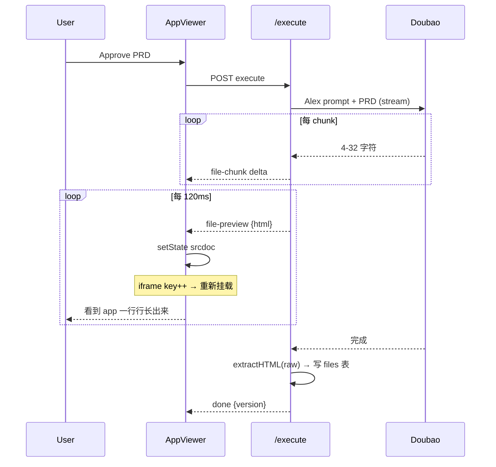
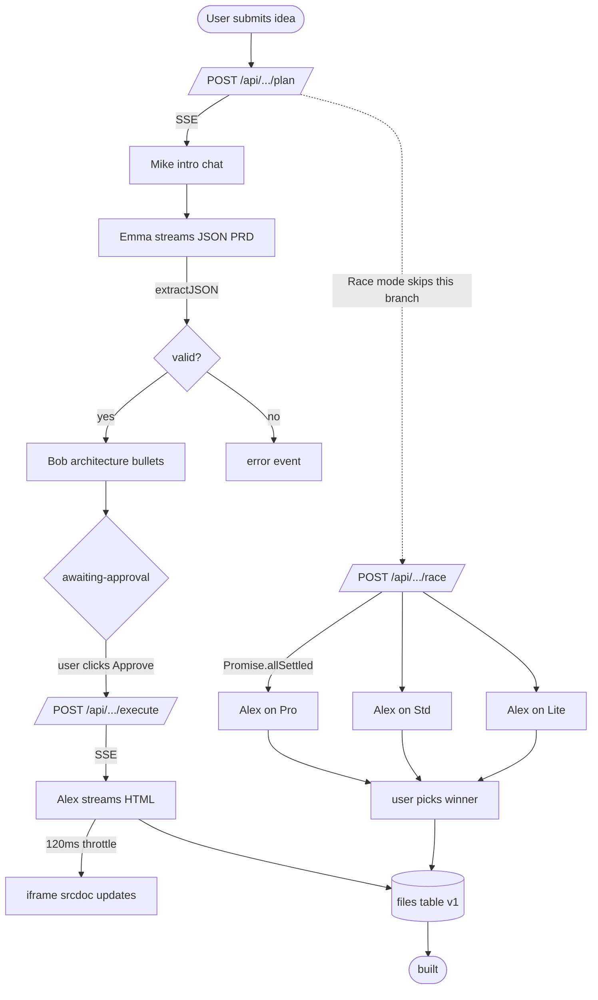

# 模块深拆 — 沙箱 & 多 Agent 协作

> 配合 [ARCHITECTURE.md](./ARCHITECTURE.md) 阅读。架构文档讲"这两块是什么"，本文讲"这两块由哪些零件组成、为什么这么拆、边界在哪"。

---

# 一、沙箱（Preview Sandbox）

## 1.1 它由两层组成 — 这是关键

很多人以为"沙箱 = iframe"。在这个 Demo 里**沙箱有两层**，缺一不可：

```
┌──────────────────────────────────────────────┐
│ 第二层 · 运行时沙箱 (iframe srcdoc)            │  ← 浏览器侧
│  - sandbox 属性约束 JS 权限                   │
│  - 跟父页面 storage / cookie 完全隔离          │
│  - 容器大小可切换 (desktop / tablet / phone)   │
└──────────────────────────────────────────────┘
                   ▲
                   │  srcdoc = <html>...</html>
                   │
┌──────────────────────────────────────────────┐
│ 第一层 · 生成约束沙箱 (Alex system prompt)     │  ← LLM 侧
│  - 强制单文件 HTML                            │
│  - 强制 Tailwind CDN（禁止其他外部 import）     │
│  - 强制 localStorage（禁止真后端调用）          │
│  - 禁止 markdown 围栏、解释、wrapper            │
└──────────────────────────────────────────────┘
```

**为什么必须两层**：只有第二层（iframe）时，LLM 输出 `<script src="https://evil.com">` 浏览器也会拦截不住（sandbox 没禁外部 script）。只有第一层（prompt）时，LLM 偶尔会"叛逆"输出多文件 / Markdown wrapper / 引用外部 React，第二层兜底保证至少 srcdoc 能写进去。两层串起来才有"不管模型说什么，最终落地都可控"的稳定性。

## 1.2 模块组成

### A. 生成约束（lib 侧）

| 文件 | 职责 |
|---|---|
| `lib/agents/prompts.ts → ALEX_SYSTEM` | 5 条硬约束：单文件 HTML / Tailwind CDN / localStorage / inline JS / 不准 markdown 围栏 |
| `lib/agents/orchestrate.ts → extractHTML(raw)` | 容错：模型偶尔还是输出 ```html ... ``` 围栏；这里剥掉 fence + 从 `<!DOCTYPE` 起截断 |
| `lib/agents/orchestrate.ts → alexBuildStream` | 把 PRD 作为 user msg 喂回模型，温度 0.5（够稳定也有创意）、max_tokens=16384（豆包 ARK 硬上限）|

**Alex system prompt 关键字（节选）**：
> "The output MUST start with `<!DOCTYPE html>`. Use Tailwind via the CDN script. All data persistence uses `window.localStorage`. **Inline ALL JavaScript. No imports, no external modules.** If the PRD asks for things that need a server (auth/payments/AI), simulate them client-side and label as demo."

### B. 流式渲染（API + UI 侧）

| 文件 | 职责 |
|---|---|
| `app/api/projects/[id]/execute/route.ts` | SSE 路由：调 alexBuildStream → 每收一个 chunk 转发 `{type:'file-chunk', delta}` + 每 120ms 节流推送一次 `{type:'file-preview', html}` |
| `components/ProjectClient.tsx` (待写) | 接 `file-preview` 事件，setState `srcdoc` → React re-render `<AppViewer>` |
| `components/AppViewer.tsx` | iframe + 设备工具栏 + 空态 + Open 新 tab |

**为什么 120ms 节流不是每 chunk 推**：每个 chunk 4-32 字符，模型一秒能吐 50+ chunk。如果每 chunk 都 `setState(srcdoc)`，React 每次都 unmount-remount iframe（key 变化），DOM 反复重排卡死。120ms 是肉眼"持续生长"的下限，CPU 又能扛得住。

**为什么不直接把字符串 dangerouslySetInnerHTML 到 iframe**：iframe 跨文档，宿主 React 改不了里面的 DOM。只能通过 `srcDoc` prop 整体替换。每次替换浏览器重新解析 + 执行 script，但 Tailwind CDN 因 HTTP 缓存第二次起就快了。

### C. 运行时隔离（iframe 属性）

```html
<iframe
  srcDoc={html}
  sandbox="allow-scripts allow-forms allow-popups allow-modals allow-same-origin"
/>
```

| sandbox flag | 为什么开 | 不开会怎样 |
|---|---|---|
| `allow-scripts` | LLM 生成的 app 100% 靠 JS 交互 | 看板拖不动、计数器不加 |
| `allow-forms` | input/submit 是基本盘 | 任何 `<form>` 提交报错 |
| `allow-popups` | "Open in new tab" 之类 | 用户体验断流 |
| `allow-modals` | localStorage 的 `confirm("清空？")` 之类 | LLM 经常用 confirm，没这个会 silent fail |
| `allow-same-origin` | **关键**，否则 `localStorage` 不能用，违反"数据持久化" P0 | LocalStorage throw SecurityError，整个 demo 持久化挂了 |

**没开的（故意）**：
- `allow-top-navigation` — 防止 iframe 跳转父页面
- `allow-downloads` — 防止恶意自动下载
- 没开 = 默认禁

### D. 工具栏（视觉锚点）

`AppViewer.tsx` 的工具栏：

- Mac 三色圆点（视觉暗示"应用窗口"，跟 Atoms 真实 App Viewer 一样）
- 假 URL pill：`atoms-cloud://preview/app.html` — 暗示"在 Atoms Cloud 跑"
- 设备切换：`desktop=100%` / `tablet=820px` / `phone=390px`（CSS 容器宽度，iframe 等比缩放）
- 刷新按钮：手动 `version+1` 触发 React key 变更，强制 iframe 重新挂载
- Open：把 srcdoc 转 Blob → `URL.createObjectURL` → `window.open` — 这是"假 Publish"的兜底，让 HR 可以真在浏览器新 tab 里玩

### E. 流式 HTML 渲染容错（最阴的坑）

模型流到一半的 HTML 大概率长这样：

```html
<!DOCTYPE html>
<html><head><script src="https://cdn.tailwindcss.com"></script></head>
<body class="bg-zinc-900 text-white p-8">
<h1 class="text-3xl">My Kanban</h1>
<div class="grid grid-cols-3 gap-4">
<div class="bg-zinc-800 p-4 rounded">
<h2>To Do</h2>
<div class="bg-zinc-7  ← 流断在这里
```

浏览器对这种"未闭合"的 HTML 非常宽容：它会自动补 `</div></body></html>`，挂载 Tailwind CDN，把已经出来的部分渲出来。**所以每 120ms 推一次 srcdoc 就有"一行行涨出来"的视觉效果**，这是 demo 视觉爆款点之一。

但有两个坑：
1. 流断在 `<script>` 里时，浏览器执行不完整 JS 会报错 → 用 try/catch 包不住，但因为 iframe 隔离不影响父页面
2. 流断在 `<!DOCTYPE` 之前（模型偶尔先来一段废话）→ `extractHTML` 必须扫到 `<!DOCTYPE` 才开始，前面的废话整段丢掉

```typescript
export function extractHTML(raw: string): string {
  const fence = raw.match(/```(?:html)?\s*([\s\S]*?)```/);
  const body = (fence ? fence[1] : raw).trim();
  const docIdx = body.search(/<!DOCTYPE/i);
  return docIdx >= 0 ? body.slice(docIdx) : body;
}
```

## 1.3 沙箱的边界（不做的事）

| 不做 | 为什么 | 后果 |
|---|---|---|
| 不跑后端代码 | 没有 Node sandbox 安全方案 | Alex prompt 禁止生成 server code，全 client-side mock |
| 不允许 import npm 包 | 浏览器原生不支持，要 esm.sh / Skypack 代理 | 锁定 Tailwind CDN + vanilla JS，复杂 lib 不在 demo 范围 |
| 不真部署到公网域名 | DNS/SSL/CDN 时间不够 | iframe srcdoc + Blob URL 的 "Open" 按钮兜底 |
| 不限制 iframe 内的 fetch | 应该上 CSP，时间不够 | 单用户演示场景风险可控，生产化时必须加 |
| iframe 跟父页面 localStorage 不共享 | 浏览器 same-origin 规则 | 每个项目的 iframe 各自隔离一份 localStorage，这反而是好事 |

## 1.4 视觉化



---

# 二、多 Agent 协作（Multi-Agent Orchestration）

## 2.1 它由四层组成

```
┌────────────────────────────────────────────────┐
│ Layer 4 · UI 渲染 (消息流 + 头像 + 状态机)        │  components/AgentMessage.tsx
└────────────────────────────────────────────────┘
                      ▲
┌────────────────────────────────────────────────┐
│ Layer 3 · 传输协议 (SSE 5 种事件)                │  app/api/.../{plan,execute,race}/route.ts
└────────────────────────────────────────────────┘
                      ▲
┌────────────────────────────────────────────────┐
│ Layer 2 · 编排策略 (顺序流水线 + 结构化中间产物)   │  lib/agents/orchestrate.ts
└────────────────────────────────────────────────┘
                      ▲
┌────────────────────────────────────────────────┐
│ Layer 1 · 角色定义 (5 个 system prompt + 角色卡)  │  lib/agents/{roles,prompts}.ts
└────────────────────────────────────────────────┘
```

## 2.2 Layer 1 — 角色定义

### 角色卡（roles.ts）

每个 agent 一份**展示元数据**，跟 LLM 无关，纯前端用：

```typescript
{
  id: "mike",
  name: "Mike",
  title: "Team Lead",
  emoji: "🧭",          // 头像
  color: "#7C5CFF",      // 高亮色（圆环、消息条）
  blurb: "Coordinates the team, asks for your approval at key checkpoints."
}
```

5 个角色：

| ID | 名字 | 职责 | emoji | 是否进入主流程 |
|---|---|---|---|---|
| **mike** | Team Lead | 路由、暖场、收尾 | 🧭 | ✅ |
| **emma** | PM | 出 PRD（结构化 JSON） | 📝 | ✅ |
| **bob** | Architect | 出数据模型 bullets | 🧱 | ✅ |
| **alex** | Engineer | 写代码（单文件 HTML） | ⚡ | ✅ |
| **iris** | Researcher | Deep Research（保留视觉） | 🔭 | ❌ 不进主流程，roster 摆设 |

### system prompt 设计原则（prompts.ts）

每个 system prompt 都遵守 4 条规则：

1. **第一人称扮演** — `"You are Emma, a senior Product Manager"`
2. **输出格式严格约束** — Emma 输出 JSON、Bob 输出 markdown bullets、Alex 输出 raw HTML，**不允许"扮演但说人话"的混合输出**
3. **任务边界明确** — 每个 prompt 说清楚"做什么、不做什么、字数上限"
4. **下游消费者已知** — Emma 写 PRD 时知道 Bob/Alex 会读它，所以字段名要可机读

举例 Emma 的 prompt 设计点：

```
- 强制 JSON 不带 markdown fence
- 字段含义在 TypeScript interface 里说明（LLM 对 TS 类型理解极好）
- 约束 task 数量 4-7、每条动词开头 ≤10 词（防止 PRD 膨胀）
- 限定 deliverable 必须是 SINGLE self-contained HTML（跟 Alex 的约束对齐）
```

## 2.3 Layer 2 — 编排策略

### 选了硬编码流水线，不选 router LLM

两种主流方案：

| 方案 | 代表 | 优点 | 缺点 |
|---|---|---|---|
| **A. Router LLM** | LangGraph supervisor | 灵活、agent 数量可扩 | LLM 一次额外调用 → 慢 + 贵 + 可能选错路径 |
| **B. 硬编码流水线** | MetaGPT SOP | 快、稳定、可调试 | 流程固定 |

**这个 Demo 选 B**。理由：

- 题目就 1 个用户场景（构建 app），固定流程 Mike → Emma → Bob → Alex 足够
- 流程可读：HR 翻 `orchestrate.ts` 一眼看清谁在什么时候被调用
- 不引入"为什么 supervisor 把活派给 Iris 而不是 Bob"的解释负担
- LangGraph 等框架的引入成本（一堆 abstraction）跟 demo 时间预算不匹配

如果继续做（[ARCHITECTURE.md §10](./ARCHITECTURE.md)），从 B 升 A 是合理的下一步。

### 模型分配 — 性价比矩阵

5 个 agent × 3 档模型（Pro / Std / Lite）的分配：

| Agent | 模型 | 理由 |
|---|---|---|
| **Mike** | `std` | 2-3 句暖场，对质量不敏感，省钱 |
| **Emma** | `pro` | 出**结构化 JSON**，最怕格式错；Pro 指令遵循最稳 |
| **Bob** | `std` | 几个 bullets，省钱 |
| **Alex** | `pro` | 写 16KB HTML，质量直接决定 demo 成败 |
| **Iris** | (未启用) | - |
| **Race Mode** | `pro / std / lite` | 同一个 Alex prompt 给三档跑，让用户看模型差异 |

这种分配在 `orchestrate.ts` 里写死，不让 LLM 自己挑。

### 通信范式 — 结构化中间产物

参考 MetaGPT 的 **"Code = SOP(Team)"** —— agent 之间不通过"自由对话"通信，而是通过**带格式的中间产物**。这个 demo 里：

```
Mike   ── 一段暖场 chat ──────────────────────────→ 用户看（不喂下游）
Emma   ── { title, tasks, target_user, ... } ─────→ Bob 读、Alex 读、UI 渲染
Bob    ── 一段架构 markdown bullets ────────────→ 用户看（暂不喂 Alex，Alex 直接吃 PRD）
Alex   ── <!DOCTYPE html>... 单文件 ─────────────→ 写文件表 + 推 iframe srcdoc
```

**关键洞察**：Emma 的输出**只对 Alex 是机读的**（Alex prompt 里说 `messages: [{role:'user', content: JSON.stringify(prd, null, 2)}]`）。对用户它是"PRD 卡片"。**同一份数据两种消费方式**，是结构化中间产物的全部价值。

### 显式 checkpoint — Approve 按钮

```
Mike 暖场 → Emma PRD → Bob 架构 → [⏸ awaiting-approval]
                                       │
                                       ▼ 用户点 Approve
                                  Alex 流式生成
```

为什么把 checkpoint 放在 Alex 之前不是 Bob 之前：

- Alex 是**最贵 + 最慢 + 最不可逆**的步骤（16384 tokens × Pro）
- 让用户在便宜的 Mike/Emma/Bob 之后看一眼，"觉得对就放 Alex 跑"
- 这是 Atoms 真实产品里 Mike 角色被强调的核心价值（"asks for approval at key checkpoints"）

### Race Mode 不是"多 agent 协作"

注意区分：

| 概念 | 这个 demo 里指什么 |
|---|---|
| **多 Agent 协作** | 5 个不同 role 的 LLM 调用流水线（Team Mode） |
| **Race Mode** | **同一个** Alex role × **3 个不同 model** 并发，比的是 model 不是 role |

Race 在 `app/api/projects/[id]/race/route.ts` 里用 `Promise.allSettled` 实现，**故意不是"多 agent 选 winner"** — Atoms 真实产品的 Race Mode 文档也是 "run the same prompt across multiple **models**"。

## 2.4 Layer 3 — SSE 传输协议

5 种事件类型，前端按 type 分发：

| event type | 字段 | 触发时机 | 前端动作 |
|---|---|---|---|
| `status` | `content` | 每段开始前 | 显示一行灰色状态文字（"Mike is routing…"） |
| `agent-message-start` | `id, agent, kind` | 一段发言开始 | 创建一条消息 `{id, agent, content: ""}` |
| `agent-message-chunk` | `id, delta` | 流式 token | append 到对应 id 的 content |
| `agent-message-end` | `id` | 一段发言结束 | 关掉 caret 闪烁 |
| `prd` | `id, agent, prd` | Emma JSON parse 成功 | 把对应消息 kind 改成 `plan`，渲染 PRD 卡片 |
| `file-chunk / file-preview / file-end` | `delta / html / size` | Alex 流式 | 累积 srcdoc，120ms 节流刷 iframe |
| `awaiting-approval` | - | 整个 plan 流程结束 | 在 PRD 卡片显示 Approve 按钮 |
| `error` | `error, raw?` | 任何步骤抛错 | 红色 toast + 不阻塞已渲染的消息 |
| `done` | - | 流结束 | 关闭 reader |

**SSE 而不是 WebSocket**：单向 server-push，HTTP/1.1 兼容，Vercel 原生 streaming 支持，比 WebSocket 简单一个数量级。

### 串行 vs 并发的 SSE 处理

```typescript
// plan/route.ts —— 串行（顺序 await）
await mikeIntro()        // 等 Mike 说完
for await emmaStream()   // 等 Emma 流完
await bobNotes()         // 等 Bob 说完

// race/route.ts —— 并发（Promise.allSettled）
await Promise.allSettled([
  raceOneModel("pro"),
  raceOneModel("std"),
  raceOneModel("lite"),
])
```

Race 用 `allSettled` 不是 `all`：**任一模型失败不能中断另两个**。这是 "可观察的工程质量" 维度的一个小亮点。

## 2.5 Layer 4 — UI 渲染

`AgentMessage.tsx` 是一个**type-driven 卡片渲染器**：

```typescript
type MessageKind = "chat" | "plan" | "status" | "file" | "race-pick" | "user"
```

每种 kind 一个组件分支：

- `chat` → `<ChatBubble>` 带流式 caret
- `plan` → `<PrdCard>` 带 todo 列表 + Approve 按钮
- `file` → `<FileCard>` 行内文件名 + KB + 写入状态
- `status` → 一行灰色文字
- `user` → 自己头像 + 自己 prompt
- `race-pick` → 绿勾 "You picked Doubao Pro"

**统一**：每条消息左边都是 `<AgentAvatar agent={msg.agent} />`，右边是发言人名 + title + 内容。视觉上"团队感"就靠这个统一布局撑起来。

## 2.6 持久化与状态机

### 消息表的设计

```sql
messages(id, project_id, agent, kind, content, meta JSON, created_at)
```

- `agent` 字段直接存 `mike / emma / bob / alex / user / system`，前端不需要 join
- `meta` 是 nullable JSON：
  - `plan` 消息存 `{prd: {...}}`
  - `file` 消息存 `{fileName, fileSize, version}`
  - `race-pick` 消息存 `{version, fileSize}`
- 单表 polymorphism 换迭代速度

### 项目状态机

```
created → planning → awaiting-approval → building → built
                              │
                              └──── (Race) ──→ racing → built
```

每次 LLM 调用包在 try/catch，单步失败不污染整体状态；前端再次进项目页时按 `messages` 表完整回放历史（刷新页不丢上下文）。

## 2.7 边界（这些刻意不做）

| 不做 | 为什么不做 | 真要做需要什么 |
|---|---|---|
| Agent 之间真"对话" | 串行流水线 + 结构化产物已经覆盖了协作语义 | 引入 conversation memory 抽象、决定谁能看谁的消息 |
| Self-reflection / critic agent | 演示场景 LLM 单 pass 质量够 | 加 "Bob critiques Emma's PRD" 步骤，至少 +2 次 LLM 调用 + UI 适配 |
| 工具调用（read_file / web_search） | Alex 不需要读历史文件就能写单文件 HTML | 接 Anthropic tool_use 或 OpenAI function calling + tool 执行循环 |
| Dynamic supervisor 路由 | 唯一场景固定流程足够 | 加 router LLM call + 多场景 prompt + 失败 fallback |
| Agent 互相 @ 提及 | Atoms Team Mode 的 @ 是 UI 糖，不是真协作 | textarea mention + 路由策略 + 多 agent 并发 |
| 跨项目 Memory | Demo 没场景 | vector store + 召回 + prompt 注入 |

## 2.8 完整 flow（一图）



---

## 一句话总结

- **沙箱 = LLM 输出约束 (prompt) × 浏览器运行约束 (iframe sandbox)**，两层串起来兜底
- **多 Agent 协作 = 角色卡 + 5 套独立 system prompt + 硬编码流水线 + 结构化 JSON 中间产物 + SSE 5 种事件**，是 MetaGPT SOP 范式的最小可工作复刻
